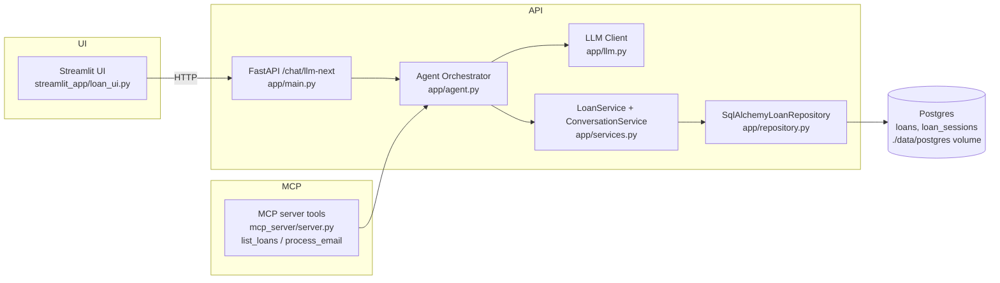

# LoanBot

Local-first FastAPI + LLaMA agent loop for multi-turn loan intake, with a Streamlit UI and an MCP server sharing the same data/service layer.

## Quickstart (local Docker, all services)
- `docker compose up --build`
- Services: API `http://localhost:8000`, Streamlit UI `http://localhost:8501`, MCP (streamable-http) `http://localhost:8765`, Postgres `localhost:5432`.
- LLM endpoint: defaults to `http://host.docker.internal:11434/v1` (Ollama/llama.cpp OpenAI-compatible). Override with `LOANBOT_LLM_BASE_URL` in compose.

If Docker Hub login blocks pulls, swap base image in `Dockerfile` to `public.ecr.aws/docker/library/python:3.11-slim`.

## Quickstart (manual)
- Install deps: `pip install -r requirements.txt`
- Launch Postgres: `docker compose up -d postgres`
- Run API: `uvicorn app.main:app --reload`
- Run UI: `streamlit run streamlit_app/loan_ui.py`
- Run MCP server: `python mcp_server/server.py` (defaults to streamable-http on `0.0.0.0:8765`)

Environment: copy `.env.example` to `.env` and set `POSTGRES_PASSWORD` (and the derived `LOANBOT_DATABASE_URL`), `LOANBOT_LLM_BASE_URL`, `LOANBOT_LLM_MODEL`, and optionally `LOANBOT_API_URL` for the UI. The defaults in `.env.example` are placeholders; change them before deploying publicly.

## Agent loop (`/chat/llm-next`)
The endpoint keeps session state in `loan_sessions`, asks LLaMA for the next question as JSON, and writes completed loans to `loans`. The orchestrator falls back to a rule-based JSON response when no LLM is available.

### Question/answer format
- Required fields (asked one at a time): applicant_name, applicant_email, amount, purpose.
- Typical prompts:
  - “What is the applicant’s full name?”
  - “What’s the best email to reach you?”
  - “How much are you looking to borrow?”
  - “What will you use the loan for?”
- The LLM must respond with minified JSON only: `{"action":"ask|save","question":"...", "missing":[...], "collected": {...}}`.
- The loop continues until all four fields are collected, then saves the loan and returns it.
- When no LLM is reachable, the fallback heuristically assigns free text to the next missing field, so entering “Rajesh” will fill `applicant_name` and move to the next question.
- If a stale LLM question is returned, the agent still advances by recomputing the next prompt from the remaining missing fields.

### Example flow
- User: “Hi, need a loan.”  
  Assistant → `{"action":"ask","question":"What is the applicant’s full name?","missing":["applicant_name","applicant_email","amount","purpose"],"collected":{}}`
- User: “Alex Doe.”  
  Assistant → `{"action":"ask","question":"What’s the best email to reach you?","missing":["applicant_email","amount","purpose"],"collected":{"applicant_name":"Alex Doe"}}`
- User: “alex@example.com”  
  Assistant → `{"action":"ask","question":"How much are you looking to borrow?","missing":["amount","purpose"],"collected":{"applicant_name":"Alex Doe","applicant_email":"alex@example.com"}}`
- User: “$25,000”  
  Assistant → `{"action":"ask","question":"What will you use the loan for?","missing":["purpose"],"collected":{"applicant_name":"Alex Doe","applicant_email":"alex@example.com","amount":25000}}`
- User: “Working capital.”  
  Assistant → `{"action":"save","question":null,"missing":[],"collected":{"applicant_name":"Alex Doe","applicant_email":"alex@example.com","amount":25000,"purpose":"Working capital"}}`
  → Loan is persisted and returned in the API response.

## MCP server
`python mcp_server/server.py` exposes tools:
- `list_loans` – read saved loans.
- `process_email` – feed an email, loop through clarifying questions with the same agent, and persist the loan.

## Architecture
- **FastAPI**: `/chat/llm-next` runs the agent loop, uses `LoanService` + `ConversationService`, persists to Postgres via SQLAlchemy async.
- **Agent Orchestrator** (`app/agent.py`): builds the next question, collects fields, saves the loan when all required fields are present.
- **LLM client** (`app/llm.py`): OpenAI-compatible chat; falls back to a rule-based path when the model endpoint is unavailable.
- **Repository pattern** (`app/repository.py`) and **services** (`app/services.py`): shared by API, MCP server, and Streamlit UI.
- **MCP server** (`mcp_server/server.py`): exposes `list_loans` and `process_email`, reusing the same services/DB.
- **Streamlit UI** (`streamlit_app/loan_ui.py`): calls the API endpoint for interactive intake.
- **Postgres**: state tables `loans` and `loan_sessions`. Data is persisted via the docker volume `./data/postgres:/var/lib/postgresql/data`.

### Dependency diagram (Mermaid)


## Useful commands (PowerShell)
```powershell
cd C:\Users\RajeshDas\source\repos\LoanBot
docker compose exec postgres psql -U loanbot -d loanbot -c "SELECT id, applicant_name, applicant_email, amount, purpose, status, extra, created_at FROM loans ORDER BY id DESC LIMIT 10;"

cd C:\Users\RajeshDas\source\repos\LoanBot
docker compose exec postgres psql -U loanbot -d loanbot -c "SELECT id, conversation_id, partial_fields, completed, created_at FROM loan_sessions ORDER BY id DESC LIMIT 10;"

# Start/stop stack
cd C:\Users\RajeshDas\source\repos\LoanBot
docker compose up --build
docker compose down

# Truncate tables (reset data)
cd C:\Users\RajeshDas\source\repos\LoanBot
docker compose exec postgres psql -U loanbot -d loanbot -c "TRUNCATE TABLE loans, loan_sessions RESTART IDENTITY CASCADE;"
```

## Production notes
- Swap the startup `create_all` with Alembic migrations.
- Point `LOANBOT_LLM_BASE_URL` to your local LLaMA (Ollama/llama.cpp OpenAI-compatible) endpoint.
- Repository pattern is in `app/repository.py`; services are shared across FastAPI, Streamlit, and MCP.
- Kubernetes manifests under `bridge/` use placeholder database credentials; supply a real `POSTGRES_PASSWORD` via a Secret before deploying.
